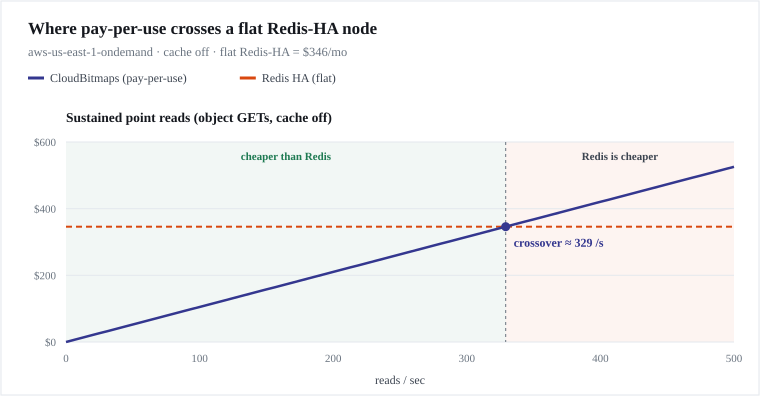

# CloudRoaring — benchmarks & the Redis crossover

> **Generated, not hand-written.** The chart and table below are produced by `pnpm bench` from the shipped
> `estimateCost()` + the default `aws-us-east-1-ondemand` pricing, so they can never drift from the
> library's own numbers. The polished, shareable version lives on the [site](../site/benchmarks.html)


CloudRoaring bills per request and per byte; a Redis-HA node bills a flat monthly rate. Below a certain
sustained write/read rate, pay-per-use is far cheaper; above it, the flat node wins. This is that crossover.

## The crossover chart

<!-- BENCH:CHART:START -->

<!-- BENCH:CHART:END -->

<!-- BENCH:STATS:START -->
| Scenario | Value | Basis | Verdict |
| --- | --- | --- | --- |
| At-rest (1.2 GiB, no traffic) | **$0.03/mo** | 0.008% of Redis | win-big |
| Write crossover | **26.33 writes/s** | 8 KiB items | past here Redis wins |
| Read crossover | **526.64 reads/s** | Topology-B, cache off | past here Redis wins |
| Redis-HA baseline | **$346/mo** | flat | the comparison line |
<!-- BENCH:STATS:END -->

## How these stay honest

Every number above is turned into a **deterministic, build-breaking CI assertion** in
[`tests/bench/anchors.test.ts`](../tests/bench/anchors.test.ts) — a regression or an overclaim fails the
build:

- **Counting is free** — `count()` on a warm-delta-free segment performs **0 payload reads**, summing
  cardinality straight from the `.crbm` index (only chunks with pending writes are fetched).
- **Chunk-skipping works** — a 5%-overlap intersection fetches ≤ 10% of a full two-segment download
  (measured through the metrics sink).
- **Cheap at rest** — the reference ~1.2 GiB set with no traffic costs ≤ 10% of a Redis-HA node.
- **We don't understate the loss** — the modeled write crossover is ≥ the published rate.
- **The estimator is trustworthy (K3)** — its prediction lands within ±20% of the engine's actual measured
  backend cost for a real workload.

## Real-cloud calibration — AWS

> ✅ **MEASURED** against real S3 + DynamoDB on **2026-07-25**, `us-east-1`, run id `2026-07-25-60291`.
> Everything else on this page is either the cost **model** (`estimateCost`) or a **local/emulated** run. This is
> the section that reports what AWS actually charged and how AWS actually responded.

**The workload:** 20 segments · 2,000 incremental writes (`add`, DynamoDB warm + OCC) · 20 segment publishes
(bulk-load → S3 PUT) · 2,000 reads (`count`, tier-merging across S3 ∪ DynamoDB) · client concurrency 16 ·
on-demand billing on a throwaway bucket + table, both torn down at the end.

Raw artifact: [`bench/calibrate-aws-results.json`](../bench/calibrate-aws-results.json). Reproduce with
`pnpm calibrate:aws` (projection only; `--run` spends money and requires an explicit region + typed
confirmation).

### What it cost

**$0.001911 — under two tenths of a cent** for 6,355 billed requests.

| Term | Billed quantity | Rate (`us-east-1` on-demand) | Cost |
| --- | --- | --- | --- |
| DynamoDB write | 2,020 WRU | $0.625/M | $0.001263 |
| DynamoDB read | 4,233 RRU | $0.125/M | $0.000529 |
| S3 PUT/LIST | 22 | $5.00/M | $0.000110 |
| S3 GET | 23 | $0.40/M | $0.000009 |
| **Total** | **6,355 requests** | | **$0.001911** |

The DynamoDB capacity units are **AWS's own `ConsumedCapacity`**, read off every response — not a
size→ceiling→units estimate. The harness cross-checks them against the request count and refuses to present the
figure as measured if they fall short; the check passed at 99.2% (6,253 units across 6,306 DynamoDB requests).

**Unit economics that fall out of it:**

| Operation | Measured cost |
| --- | --- |
| Incremental `add()` (read-modify-write + OCC) | **$0.75 per million** |
| `count()` on a published segment | **$0.14 per million** |
| Segment publish (bulk-load → one S3 PUT) | **$5.88 per million** |

For contrast, the always-on Redis-HA line this project exists to undercut is **$346/mo** — standing, whether or
not you send it traffic.

**One honest floor.** AWS bills a failed conditional write at 1 WCU, but the 53
`ConditionalCheckFailedException` responses carried no `ConsumedCapacity`, so the meter could not recover those
units. True total is ≈ **$0.001944**; the published figure understates by $0.000033 (1.7% of the write term).

### Why the projection said $0.18 and the bill was $0.0019

The harness refuses to run until its **projection** fits under a spend ceiling, and that projection assumes
*every* write exhausts all 16 of the engine's OCC retries. The real conflict rate at 16-way concurrency was
**2.65%** — 53 retries across 2,053 write attempts, **1.027 attempts per write**. Hence the 95× gap. The ceiling
is a genuine upper bound, not a forecast; a run that fits under it cannot surprise you, and one that does not fit
gets refused rather than trimmed.

### Cost-safety evidence

A calibration run's real job is catching the ways a cloud library quietly bills you more than its model says.
What the wire-level meter shows:

| Failure mode | Evidence it did not happen |
| --- | --- |
| **SDK retry storm** (throttling/5xx backoff — each attempt billed) | `attempts` equals `commands` for **every** command type: 6,355 = 6,355. Zero retries. |
| **Runaway OCC loop** | 1.027 attempts per write against a bound of 17. |
| **LIST-per-read** (LIST bills at the PUT rate, **12.5× a GET**) | `cold.list = 0`. The read path issues none. |
| **Cold re-fetch per read** | 22 S3 GETs served 2,000 reads — each of the 20 segments fetched ~once, then served from the bounded HOT LRU. |
| **Standing hourly charges** | Table created `PAY_PER_REQUEST`; no streams, PITR, versioning, or Contributor Insights. Nothing bills by the hour. |
| **Orphaned resources** | Teardown deleted both, and a follow-up `list-buckets` / `list-tables` sweep plus direct probes confirmed 404 / `ResourceNotFoundException`. |

The 55 attempts that returned an error are all accounted for, and all billed-but-expected: 1 `HeadBucket` 404 and
1 `DescribeTable` `ResourceNotFound` (the pre-create probes), plus the 53 OCC conflicts. Control-plane calls
(`Create*`/`Describe*`/`Delete*`) and S3 DELETE are free; storage-time was ~23 KB for ~90 s (≈$10⁻⁹) and egress
~25 KB, inside the free monthly allowance.

### What it cost in latency — and why the number is what it is

| Phase | ops/s | p50 | p99 | p999 | max |
| --- | --- | --- | --- | --- | --- |
| WRITE (`add` → DynamoDB OCC) | 73 | 197.72 ms | 476 ms | 775.81 ms | 776.79 ms |
| PUBLISH (bulk-load → S3 PUT) | 18 | 633.91 ms | — | — | 733.26 ms |
| READ (`count` → S3 ∪ DynamoDB) | 140 | 95.47 ms | 309.73 ms | 378.68 ms | 479.97 ms |

`—` where a 20-observation sample cannot support the percentile; we print `—` rather than three "statistics"
derived from one data point.

**These are client-outside-the-region numbers, and they are almost entirely network transit.** The run was
driven from a laptop over a corporate network, so before reading anything into the table, here is the measured
floor from the same machine at the same time — median of 10 raw TCP connects, no AWS call, no charge:

| Path | 1 raw TCP round trip to `us-east-1` |
| --- | --- |
| `dynamodb.us-east-1.amazonaws.com` | **96.0 ms** (min 89.3) |
| `s3.us-east-1.amazonaws.com` | **92.6 ms** (min 87.1) |

Line that up against the phases and the whole table decodes:

- **READ p50 95.47 ms ≈ one round trip (96.0 ms).** A `count()` on a published segment is one DynamoDB round
  trip; the engine's own work, and DynamoDB's service time, are inside the measurement noise at this distance.
- **WRITE p50 197.72 ms ≈ two round trips (192 ms).** An `add()` is read-modify-write under OCC — a `GetItem`
  then a conditional `UpdateItem`, necessarily sequential. Exactly 2× the read, as the protocol requires.
- **Throughput is the concurrency window, not a ceiling.** 16 ÷ 0.198 s ≈ 81/s against 73/s measured; 16 ÷
  0.0955 s ≈ 168/s against 140/s measured. Both track concurrency ÷ latency to within the mean-vs-median gap.
  Raising concurrency raises throughput near-linearly; the engine is not the limit.

So this run **calibrates the cost claim and does not calibrate the in-region latency claim** — it cannot. The
[North Star](internal/) target for a warm `has()` is a single-digit-to-~25 ms round trip, and the
network floor here is 96 ms, roughly **4× that entire budget**. Nothing in this table contradicts the target;
nothing in it confirms the target either. Confirming it needs a client inside the region (Lambda/EC2 in
`us-east-1`), which is a named follow-up, not a claim we make from this data.

### Is that acceptable for a segmentation engine?

Worth answering directly, because "197 ms per write" invites the wrong conclusion. **Per-operation latency is
not the metric that governs a segmentation workload**, and the paths that do govern it are the ones the
architecture is built around:

- **Building or refreshing a segment of N million users** is `bulkLoadCrbmGeneration` → **one (or a few
  multipart) S3 PUTs**, bounded by the *compressed bytes* of the roaring bitmap, not by N. Ingesting ten million
  users is a multi-MB upload, not ten million round trips.
- **Membership checks at query time** are absorbed by the bounded HOT LRU — the 22-GETs-for-2,000-reads result
  above is that effect. The irreducible floor is the warm-delta read that
  [tier-merging correctness](internal/) requires; callers who can tolerate read-after-write lag
  drop it to ~½ RCU with `warmReadConsistency: 'eventual'`.
- **Audience counts are free.** `count()` on a warm-delta-free segment performs **0 payload reads**, summing
  cardinality from the `.crbm` index — so counting a ten-million-user segment does not scale with N.
- **Intersections skip.** Two 2,000,000-id segments intersect by fetching only the shared chunks — [measured
  above](#at-scale--measured-1k--10k--100k-segments) at 100 of 2,000 chunks per segment in 25.3 ms. This is the case where
  an always-on RAM store has to hold both bitmaps resident and CloudRoaring does not.

**The one pattern that does not scale to millions is `add()` in a loop — a routing decision, not a performance
bug.** At the measured $0.75 per million writes, streaming 10M users in one at a time costs ~$7.50 and, at this
run's 73 writes/s, takes on the order of a day and a half. The same ids batched through `addMany()` collapse to
**one write per 65,536-id chunk** — roughly 150 writes for a dense 10M set — and bulk-loaded they become a
handful of S3 PUTs:

| 10M ids via | Backend ops | Cost | Basis |
| --- | --- | --- | --- |
| `add()` in a loop | 10,000,000 read-modify-writes | ~$7.50 – $52 | **measured** rate; range is warm-row size |
| `addMany()` in batches | ~150 chunk writes (dense) → ≤65,536 (sparse) | ~$0.001 – $0.05 | derived from the measured unit rates |
| `bulkLoadCrbmGeneration()` | a handful of S3 PUTs | ~$0.00001 | derived |

The loop is a **range, not a number**, because DynamoDB bills writes per 1 KiB and a chunk's warm delta grows as
you fill it. The $0.75/M measured above is a small row (1 RRU + 1 WRU) — what this run exercised, at ~500 ids per
segment. A chunk carrying a full ~8 KiB roaring bitmap costs 2 RRU + 8 WRU on every subsequent `add()`, i.e.
**$5.25/M**. So the denser the data, the worse the loop gets — and density is exactly the condition under which
bulk-load was the obvious call.

So the rule is **batch when you can, and bulk-load when you are replacing rather than amending**: `add()`/
`addMany()` for deltas (a user newly qualifies), bulk-load for segment builds and refreshes. Bulk-load cannot
express "one more user" or a removal at all — it replaces a whole generation — which is why all three paths
exist rather than one. The guide says the same, and the cost model prices all of them.

Where an always-on RAM store still wins: a sub-millisecond in-region p99 on a working set that does not fit the
HOT cache. That trade is stated plainly in
the design docs, and it has not changed.

### What this section is not

- **It is prices × wire-metered ops, plus a reconciliation — not the invoice.** AWS billing lags hours and has no
  per-run granularity, so the run tags its resources (`cloudbitmaps-calibration=<runId>`) and the Cost Explorer
  comparison follows a day later.
- **The measured cost counts S3 PUTs**, which the library's own metrics sink cannot see (it emits no `cold.put` event — a [known observability gap](internal/)). That is why the meter sits at the AWS
  SDK layer instead. PUTs bill at 12.5× a GET, so an ingest-heavy workload priced without them is materially
  understated — which is exactly the flaw in the LocalStack figures above.
- **One run, one region, one client, one workload shape.** Method, safety properties, and the explicit list of
  what it does *not* cover is recorded with the run.

## At scale — measured (1K → 10K → 100K segments)

> **Measured, not modeled.** Unlike the cost curves above (which come from the estimator), the numbers here are
> wall-clock + memory from a real run of `pnpm bench:scale` that builds a fleet of up to 100K segments on local
> disk and reads across all of it. They're machine-dependent — a point-in-time snapshot, **not** a CI gate.

The [production-readiness audit](internal/) flagged three scale risks — an unbounded
`.crbm` reader cache, `O(total)` compaction discovery, and intersection unproven under load. Phases C/D/G closed
them; this is the measured evidence at fleet scale:

<!-- BENCH:SCALE:START -->
| Fleet | Live heap (cap 1024) | Peak RSS | Discovery scan |
| --- | --- | --- | --- |
| 1,000 segments | 7.8 MiB | 63.1 MiB | 80.2 ms |
| 10,000 segments | 7.9 MiB | 114.7 MiB | 1,522.7 ms |
| 100,000 segments | 7 MiB | 178 MiB | 12,954.4 ms |

Intersection of two 2,000,000-id segments (2,000 chunks each, 100 shared): **fetched only 100 of the 2,000 chunks per segment** — the shared keys; the rest skipped by key alignment — in 25.3 ms.

_Measured on Apple M3 Pro (arm64, node v24.14.1). **The bound is the live heap** (post-GC), flat at 7.8 MiB @ 1,000 · 7.9 MiB @ 10,000 · 7 MiB @ 100,000 — the reader cache holds bounded live data regardless of fleet. Process **peak RSS** (shown for context) is a high-water that also folds in the benchmark's own fleet-*seeding* allocations and isn't returned to the OS after GC, so it grows with fleet here — it is not a clean read-path footprint (isolating read-path RSS in a reader-only process is a follow-up). Fleet seeded at ~42–55 durable segments/s (fsync-bound); discovery is LocalFs-filesystem-bound — the `O(total)` **shape** is the point, not the absolute ms._
<!-- BENCH:SCALE:END -->

- **Memory is a function of the working set, not the fleet.** The cold-reader cache is capped by open-segment
  _count_ (`maxOpenSegments`, default 1024) **and** aggregate parsed-index _bytes_ (`maxOpenIndexBytes`, default
  64 MiB), so **retained live heap after reading the _entire_ fleet is flat from 1K to 100K segments** — a 100×
  larger fleet holds the same resident reader set (audit gap #1), and unusually _wide_ segments can't pin
  gigabytes of indices while the count looks "in bounds". Peak RSS is shown for context only: it is a **process
  high-water** that also folds in the benchmark's own fleet-_seeding_ allocations (not returned to the OS after
  GC), so it grows with fleet size here and is **not** a clean read-path footprint. The flat **live-heap** column
  is the bound. Note: live heap + [the soak's native-memory watch](internal/) prove **no leak**
  on the read path; a hard RSS ceiling under a cgroup `--memory` limit **shipped in Phase 8 as `pnpm rss-gate`**
  (a soak under a hard `docker --memory` ceiling with swap off; an OOM-kill → exit 137).
- **Discovery is `O(total segments)`** per cycle (the registry enumeration) — the near-linear discovery column.
  Sharding (`totalShards`) splits the Warm drain but not the enumeration; the `O(dirty)` indexed-enumeration
  cursor is a documented deferral (gap #3).
- **Chunk-skipping intersection holds at scale** — intersecting two large multi-chunk segments fetches only the
  shared chunks and skips the rest by key alignment (the crown jewel, on the ids-per-segment axis).

## Caveats

- **Default pricing** (`aws-us-east-1-ondemand`, 8 KiB items, cache off, strongly-consistent warm reads).
  Your region/cloud/provisioned capacity/cache-hit rate move the crossover — feed your own `PricingProfile`
  and workload to `estimateCost()`.
- **Model, not a cloud bill** — the dollars in the crossover chart come from the cost formulas + published
  rates. Measured AWS dollars live in [Real-cloud calibration](#real-cloud-calibration--aws).
- **Three kinds of number here.** The crossover chart is _modeled money_ (estimator, deterministic, CI-gated);
  the at-scale table is _measured memory + latency_ (real run on local disk, machine-dependent, never CI-gated —
  shared runners are too noisy); and the real-cloud section is _measured AWS cost + latency_ (owner-run against a
  real account, 2026-07-25). Only the third is cloud-calibrated, and even then the dollars are published prices
  applied to wire-metered requests plus an invoice reconciliation, not the invoice itself.
- **The real-cloud latency figures are client-outside-the-region.** They are dominated by a measured 96 ms
  internet round trip and so calibrate the **cost** claim, not the in-region latency claim — see
  [Real-cloud calibration](#what-it-cost-in-latency--and-why-the-number-is-what-it-is).

## Reproduce

```sh
pnpm bench         # builds, then regenerates bench/crossover.svg, bench/results.json, and the cost table here + the site
pnpm bench:scale   # HEAVY: builds a fleet up to 100K segments on local disk (fsync-bound), measures, rewrites the at-scale table
SCALE_FLEETS=1000,10000 pnpm bench:scale   # smaller + faster for a quick check
pnpm calibrate:aws # real-cloud cost/latency. Prints a projection and exits; `--run` needs an explicit region
                   # + typed confirmation and SPENDS REAL MONEY. Rehearse it free against LocalStack first —
                   #md
```

See the [cost-model spec](internal/) for the formulas and the
[getting-started guide](guide/getting-started.md) for the estimator API.
