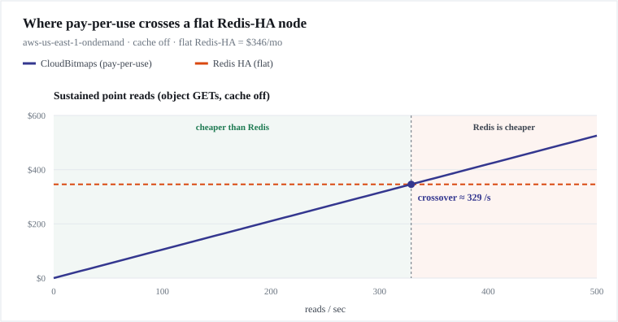

# CloudBitmaps — benchmarks & the Redis crossover

> **Generated, not hand-written.** The chart and table below are produced by `pnpm bench` from the shipped
> `estimateCost()` at the default `aws-us-east-1-ondemand` rates: the line against one three-node Redis-HA cluster,
> `ONE_REDIS_HA_CLUSTER`, whatever the data size, and the table's last row against the Redis the default profile
> sizes for the reference set. `pnpm bench:check` fails CI when either drifts from the library's own numbers. The
> polished, shareable version lives on the [site](../site/benchmarks.html)

CloudBitmaps bills per request and per byte; a Redis-HA cluster bills a flat monthly rate. Below a certain
sustained read rate, pay-per-use is far cheaper; above it, the cluster wins. This is that crossover.

There is **one** crossover, not two, because a loaded store has no per-id write to plot: data enters as a whole
generation — one object PUT, a few when multipart, then the pointer — which the estimator prices as `loadsPerMonth`
rather than as a rate. Reads are the axis where a flat, always-on cluster competes.

## The crossover chart

<!-- BENCH:CHART:START -->

<!-- BENCH:CHART:END -->

<!-- BENCH:STATS:START -->
| Scenario | Value | Basis | Verdict |
| --- | --- | --- | --- |
| At-rest (1.2 GiB, no traffic) | **$0.03/mo** | 0.008% of the $346 cluster | win-big |
| Read crossover | **329.15 reads/s** | object GETs, cache off | past here the cluster is cheaper |
| Redis-HA baseline | **$346/mo** | one cluster, whatever the data size | the comparison line |
| The Redis the default prices for the 1.2 GiB set | **$142.35/mo** | 3 × cache.t4g.medium, the cheapest cluster in the catalogue that holds it | the line would sit at 135.42 reads/s |
<!-- BENCH:STATS:END -->

The comparison line is **$346/mo**, standing, whether or not you send it traffic: an ElastiCache HA cluster of
**1 primary + 2 replicas on `cache.m7g.large`** (~$115/mo single-node). The spec is stated because the number is
otherwise unauditable — a reader cannot judge a baseline without knowing whether it is sized for the reference
dataset or several times larger than it. Look up the instance class and check us.

"Redis" is the legible example of the axis, not the opponent: the axis is **reserved capacity vs metered
requests**, and any always-on node crosses any per-request meter somewhere.

## How these stay honest

Every number above is turned into a **deterministic, build-breaking CI assertion** in
[`tests/bench/anchors.test.ts`](../tests/bench/anchors.test.ts), and the estimator's request counts in
[`tests/core/cost.test.ts`](../tests/core/cost.test.ts); `pnpm bench:check` holds the chart, the table and
`bench/results.json` to the same estimator — a regression or an overclaim fails the build:

- **Counting is free** — `count()` on a loaded segment performs **0 payload reads**, and a cold one is **one pointer
  read** and no read of the object: the registry row records the generation's id count. The index sum answers only
  when the row has no summary it can use.
- **Chunk-skipping works** — the chunks a 5%-overlap intersection fetches come to ≤ 10% of the bytes of a full
  two-segment download (measured through the metrics sink, which counts chunk reads).
- **Cheap at rest** — the reference ~1.2 GiB set with no traffic costs ≤ 10% of the $346 cluster.
- **The published crossover is the modelled one** — the estimator's read crossover, at the pessimal cache
  posture, is asserted against the rate this page prints, over the same $346 baseline.
- **The estimator never quotes fewer chunk reads than the engine makes** — priced against the chunk GETs a metrics
  sink observed for a point-read workload on an in-memory store, the prediction must land on or above the measured
  cost. That covers point reads' chunk GETs.
- **The estimator counts what the engine sends** — a cold intersect's pointer and index reads for each operand before
  its chunks, what `store.load()` adds to a load's object write, the registry reads and writes of a retirement and of a purge in
  the retention sweep, and at most one pointer read per hot segment per `cache.genTtlMs`. A test drives the real engine over the single-bucket registry protocol and holds each count to
  the requests it makes, on S3's request shape, which GCS shares. Azure Blob shares it for a pointer read and makes
  two requests for a tail read, which the pricing profile's `requestsPerSizedRead` carries; `requestsPerPointerRead`
  carries a pointer read's. A fleet of readers pays the refresh once per reader,
  which `readerProcesses` carries. And it still quotes low where it cannot see: more hot segments than a reader
  keeps open (1,024 by default), which re-opens them as it reads them; the index every reader opens again after
  each load; an intersect slow enough to outlive `cache.genTtlMs`, which re-reads its pointers; an operand whose
  index outgrows the tail read, one more GET; and a load that loses a publish race, which reads the pointer again.

## Real-cloud calibration — AWS

One run of the loaded store against real S3 in `us-east-1` is published here, driven from AWS CloudShell inside the
region. It measured the published packages on the topology that ships, with the pointer in the same bucket as
the data: what a cold intersect, an `andNot` and a load cost, and how long they take.

### The in-region run — run `2026-10-06-9d36b`

> **Measured** against real S3 in `us-east-1` on 2026-10-06 (UTC), from AWS CloudShell in the same region, with the
> published packages and a client of 128 sockets, the number this release's own client allows: a round-trip
> floor of 4.50 ms. The run's report explains every figure:
> [`bench/calibration/2026-10-06-9d36b.md`](../bench/calibration/2026-10-06-9d36b.md). The evidence beside it is the
> harness's own results file. [`tests/docs/calibration-reports.test.ts`](../tests/docs/calibration-reports.test.ts)
> holds this section and the report to it in both directions: every dollar amount, percentage, duration, byte size
> and ratio, every number written before the request, chunk, id or load it counts, and the bill below, row by row.

A combine or `iterate` reads each operand's needed chunks as ranges: chunks within 256 KiB of each other are one request,
up to 1 MiB, and each chunk is checked exactly as when it is read alone. So a request count follows how the shared
chunks lie in the object, not how many there are.

**What it establishes:**

- **Chunk-skipping works on real S3.** 40 of 40 cold intersects of two 500,000-id segments returned the planned ids,
  checked by count and by sum. Each fetched 100 of 1,999 chunks per segment, the 100 the two share, and skipped the
  other 95.0%.
- **A cold intersect of that shape took 99.80 ms at the median** (p95 120.32 ms, p99 141.24 ms) and made 6 GETs: one
  pointer read and one 256 KiB tail read per operand, and one range read each for the shared chunks, which lie together.
  Each GET round took about 25 to 30 ms (**derived**), more than the round-trip floor.
- **The same intersect with the 100 shared chunks spread across each segment** took 103.06 ms at the median and also made
  6 GETs. Each range returned 1,022,196 bytes of an operand, against the 51,600 bytes the packed layout's range returned:
  the bytes between the chunks come with them (**derived**).
- **Latency grows with the overlap, the requests do not.** At 1,000 shared chunks the median was 197.74 ms, and at
  2,000 it was 304.28 ms, 1.54 times as long for twice the chunks, with 6 GETs both times: each range carried more bytes.
- **A warm intersect took 7.32 ms** at the median and made no request.
- **Point reads.** A cold `count()` is one request, 27.19 ms at the median. `has()` on an open segment is one
  request, 26.10 ms, and microseconds once the chunk is cached.
- **Load throughput.** A single-part `store.load()` of a 1.05 MB segment ran at 2.59 million ids a second, 5,443,673
  bytes a second; a multipart load of a 12.6 MB segment at 6.88 million ids a second, 6,899,407 bytes a second.
  Every load was a segment's first, and made 2 PUT + 3 GET single-part and, for a multipart load, 5 PUT-class + 3 GET.
- **`andNot`** of a 1,999-chunk segment against ten excludes took 351.64 ms at the median and made 33 GETs: for each
  of the eleven operands, a pointer read, a tail read and one range read.
- **A steady `store.load()` at `keep: 12` is measured.** One segment was loaded in 18 loads, and each load made the
  requests of its kind (the table below). A segment's first load made 2 PUT + 3 GET. A reload made 2 PUT + 2 GET.
  A load that deletes by name made 2 PUT + 4 GET and a delete, 7 requests. The load that lists made 3 PUT-class + 5 GET
  and a delete, 9 requests.
- **The rounds sit above the rounds model.** A cold intersect took 3.9 rounds against the model's 3, and the sweeps
  7.5 and 12.1. The client had 128 sockets and no stage held more than 11 requests in flight, so a socket limit did not
  bind. The run does not say why the rounds are above the model.

| Operation | Requests | One | Per million | Label |
| --- | --- | --- | --- | --- |
| Cold intersect, two 500,000-id segments sharing 100 of 1,999 chunks, the median measured | 6 GET | $0.0000024 | **$2.40** | derived |
| The same, with each pointer read once, as inside the region | 6 GET | $0.0000024 | $2.40 | expected |
| A segment's first single-part `store.load()` in the calibration run, a 1.05 MB segment, pointer included | 2 PUT + 3 GET | $0.0000112 | **$11.20** | derived |
| A segment's first multipart `store.load()` in the calibration run, a 12.6 MB segment | 5 PUT-class + 3 GET | $0.0000262 | **$26.20** | derived |

A steady load, by kind of load, at `keep: 12` on the same run: the requests are measured, and the price is the
list price.

| Kind of load | Loads | Requests | One | Per million | Median time |
| --- | --- | --- | --- | --- | --- |
| First | 1 | 2 PUT + 3 GET | $0.0000112 | **$11.20** | 81.73 ms |
| Reload | 12 | 2 PUT + 2 GET | $0.0000108 | **$10.80** | 109.47 ms |
| By name | 4 | 2 PUT + 4 GET + 1 delete | $0.0000116 | **$11.60** | 176.94 ms |
| Listing | 1 | 3 PUT-class + 5 GET + 1 delete | $0.0000170 | **$17.00** | 220.58 ms |

A cycle is 16 loads, of which 15 delete by name and one lists. Averaged over a cycle, a million single-part loads cost **$11.94**
(**derived**, from the two kinds it is made of; the run listed once). The first load and the listing are one load each,
so their medians are single loads. The run measured `keep: 12` only: it does not establish the requests at another
`keep`, and the delete is free.

**Derived** rows are measured request counts times the `aws-us-east-1-ondemand` list prices: the GETs and PUT-class requests are
measured, and the price is the list price. The second row is the code's prediction, which the run met exactly. The two
load rows are a segment's first load; a reload and a steady load are in the table above. PUT-class requests are the ones S3 bills at the PUT rate, listings
included. The whole run was 138 PUT-class and 5,162 GET-class requests, teardown included, and its requests cost
$0.0027548, against a projected upper bound of $0.045593. Inside the region there is no data-transfer charge to add.

**Against the $346-a-month Redis-HA line**, that is 144.2 million cold intersects of this shape a month, 54.9 every
second, or 30.9 million single-part loads at the run's price for one. Below those rates this design costs less; above them, the standing
node does. Every intersect in the run was cold on purpose. A long-lived reader answers a repeat from memory, and pays
instead for the pointer refresh: at most one GET per segment every 2 s while the segment is being read.

**What it does not establish:**

- **Lambda.** A function's cold start and initialisation need a run from inside one.
- **Other shapes**: more operands, other combine shapes, the `*Into` verbs.
- **Chunks that lie far apart.** A layout whose shared chunks are more than 1 MiB apart in an object makes more than
  one range request; the run's layouts, packed and spread, were one range.
- **Bytes outside the region.** Inside the region S3 Standard does not bill the bytes read. Across regions and to the
  internet it does, and the transfer can cost more than the requests saved
  ([production](guide/production.md#reading-ranges-the-bytes-between-chunks)). The spread layout's ranges read
  1,022,196 bytes a range, against the packed layout's 51,600; what that costs outside the region is not measured.
- **Other clouds.** GCS and Azure Blob have no in-region run.
- **One client on one day.** The 25 to 30 ms GET round is this run's, not a guarantee. Latencies of runs from different CloudShell sessions are not comparable; the request counts are what repeats.
- **A steady load at other `keep` values.** The run measured `keep: 12`, one first load and one load that lists.

**`estimateCost()` counts what this run's bill counted**: each cold operand's pointer and tail read, and a request for
each range read, which prices this run's intersect at 6 GETs; what `store.load()` adds to its object's write; and the
pointer refresh, for the segments a long-lived reader keeps reading. The
[guide](guide/cost.md#what-each-term-counts) says what each term counts.

### Expected, not measured

> **Expected**, not measured. The counts are what the engine makes, taken by running it over the in-memory backend on the
> calibration's layouts ([`bench/range-counts.json`](../bench/range-counts.json), written by
> [`bench/range-counts.cjs`](../bench/range-counts.cjs) and held to the engine in CI); each dollar figure is a count at the
> `aws-us-east-1-ondemand` list prices.

| Operation | Requests | One | Per million | Label |
| --- | --- | --- | --- | --- |
| `iterate` over a 1,999-chunk segment | 3 GETs: a pointer and a tail read, and one range | $0.0000012 | $1.20 | expected |

The run did not time `iterate`. Its count follows the same rule as the combines the run measured. A segment's first, reload and steady loads are measured by the run above. For the sizing
guide's medium and large deployments, whose chunks are larger, the requests are [counted for each overlap and
layout](guide/sizing.md#how-much-the-overlap-matters). The layouts are the calibration's, of about 500-byte chunks;
real ids are often denser, and the guide counts larger chunks.

## Large operands — run `2026-10-07-88cd3`

> **Measured** against real S3 in `us-east-1` on 2026-10-07 (UTC), from AWS CloudShell in the same region (2 CPUs, a
> round-trip floor of 4.7 ms to the region, so in-region), through the published `0.18.3` packages. This is the first run of
> the harness's [large suite](../bench/README.md#the-large-suite): combines on operands of about a million, five million
> and ten million ids, about 1,500 chunks each, 20 % of their ids shared. The evidence is
> [`bench/calibration/large/2026-10-07-88cd3.json`](../bench/calibration/large/2026-10-07-88cd3.json). It has no report
> file; this section and the evidence's own gate (`tests/bench/calibrate-large.test.ts`) are its record.

**Cold combines.** Each row is 40 uncached reads on a fresh store. Every read returned exactly the ids the layout says,
and every median GET count is the one the engine was expected to make (**measured**).

| Ids an operand | Combine | Median | 95th percentile | 99th percentile | Median GETs | As expected |
| --- | --- | --- | --- | --- | --- | --- |
| 1,000,000 | `intersect` | 108.8 ms | 140.9 ms | 143.9 ms | 6 | yes, exact |
| 1,000,000 | `union` | 203.5 ms | 240.7 ms | 248.4 ms | 8 | yes, exact |
| 1,000,000 | `andNot` | 144.9 ms | 189.8 ms | 200.4 ms | 7 | yes, exact |
| 5,000,000 | `intersect` | 140.0 ms | 217.7 ms | 233.1 ms | 8 | yes, exact |
| 5,000,000 | `union` | 532.3 ms | 733.8 ms | 795.8 ms | 24 | yes, exact |
| 5,000,000 | `andNot` | 323.0 ms | 414.8 ms | 417.5 ms | 16 | yes, exact |
| 10,000,000 | `intersect` | 158.0 ms | 264.8 ms | 278.9 ms | 10 | yes, exact |
| 10,000,000 | `union` | 682.7 ms | 889.3 ms | 1,005.2 ms | 26 | yes, exact |
| 10,000,000 | `andNot` | 392.4 ms | 500.0 ms | 590.3 ms | 18 | yes, exact |

**The `*Into` verbs.** Each verb ran 5 calls a size onto a destination segment of its own, on a fresh store, and each
published exactly the cardinality the layout says. An output of more than one part is written as a multipart
upload. The median is of the 5 calls; the first call makes one GET more than the repeats (**measured**).

| Ids an operand | Verb | Median | Output | Written as | PUT-class a call | GETs a call (first, repeat) |
| --- | --- | --- | --- | --- | --- | --- |
| 1,000,000 | `intersectInto` | 259.8 ms | 0.41 MB | one PUT | 2 | 9, 8 |
| 1,000,000 | `unionInto` | 479.7 ms | 3.67 MB | one PUT | 2 | 11, 10 |
| 1,000,000 | `andNotInto` | 345.9 ms | 1.63 MB | one PUT | 2 | 10, 9 |
| 5,000,000 | `intersectInto` | 352.3 ms | 2.01 MB | one PUT | 2 | 11, 10 |
| 5,000,000 | `unionInto` | 1,392.4 ms | 18.07 MB | 3 parts | 6 | 27, 26 |
| 5,000,000 | `andNotInto` | 605.5 ms | 8.03 MB | one PUT | 2 | 19, 18 |
| 10,000,000 | `intersectInto` | 340.9 ms | 2.26 MB | one PUT | 2 | 13, 12 |
| 10,000,000 | `unionInto` | 1,337.6 ms | 20.32 MB | 3 parts | 6 | 29, 28 |
| 10,000,000 | `andNotInto` | 857.9 ms | 9.03 MB | 2 parts | 5 | 21, 20 |

**Loads.** The six operands went through `store.load()`: a single-part load (the 1,000,000-id operands, 2 loads) at a
median of 3.84 million ids a second, and a multipart load (the 5,000,000 and 10,000,000-id operands, 4 loads) at 5.67
million ids a second (**measured**).

**The run's requests.** Each stage made exactly the requests it was expected to, and none more, with no discarded
sample (**measured**):

| Stage | PUT-class | GET-class |
| --- | --- | --- |
| loads | 24 | 18 |
| intersects | 0 | 960 |
| unions | 0 | 2,320 |
| `andNot`s | 0 | 1,640 |
| `*Into` calls | 145 | 714 |
| the whole run, the bucket's own requests included | 173 | 5,663 |

The evidence records the run's bill, by request class, at the `aws-us-east-1-ondemand` list prices (`cost` in the file).

**What these figures are not.** The large suite drains each read a chunk at a time with `.batches()`; the default suite
drains one id at a time, so the latencies above are **not comparable** with the in-region run's. Latencies of runs from
different CloudShell sessions are not comparable either, and this is one session. It is one client, with 128 sockets and
2 CPUs, one storage class in one region, cold reads on fresh stores, and operands of array and bitset containers, none of
them run-encoded.

## At scale — measured (1K → 10K → 100K segments)

> **Measured, not modeled.** Unlike the cost curve above (which comes from the estimator), the numbers here are
> wall-clock + memory from a real run of `pnpm bench:scale` that builds a fleet of up to 100K segments on local
> disk and reads across all of it, and intersects two large segments on in-memory storage. They're
> machine-dependent — a point-in-time snapshot, **not** a CI gate. What CI does check is that the table below is
> what the committed results file renders.

Three things could make a large fleet expensive to run: an unbounded `.crbm` reader cache, an `O(total)`
fleet-wide registry scan, and an intersection of large segments that read more than it needs. This is the
measured evidence at fleet scale:

<!-- BENCH:SCALE:START -->
| Fleet | Retained heap (cap 1024) | Peak RSS | Discovery scan |
| --- | --- | --- | --- |
| 1,000 segments | 8.2 MiB | 68.1 MiB | 87.6 ms |
| 10,000 segments | 8.3 MiB | 86.8 MiB | 1,067.9 ms |
| 100,000 segments | 7.4 MiB | 162.2 MiB | 11,606.4 ms |

Intersection of two 2,000,000-id segments on in-memory storage (2,000 chunks each, 100 shared): **fetched only 100 of the 2,000 chunks per segment** — the shared keys; the rest skipped by key alignment — in 24.6 ms, which times the engine rather than object storage.

_Measured on Apple M3 Pro (arm64, node v24.18.1). **The bound is the retained heap** (post-GC), flat at 8.2 MiB @ 1,000 · 8.3 MiB @ 10,000 · 7.4 MiB @ 100,000 — the reader cache holds bounded live data regardless of fleet. Process **peak RSS** (shown for context) is a high-water that also folds in the benchmark's own fleet-*seeding* allocations and isn't returned to the OS after GC, so it grows with fleet here — it is not a clean read-path footprint (isolating read-path RSS in a reader-only process is a follow-up). Fleet seeded by writing and publishing each generation at ~38–51 durable segments/s (fsync-bound); discovery is LocalFs-filesystem-bound — the `O(total)` **shape** is the point, not the absolute ms._
<!-- BENCH:SCALE:END -->

- **Memory is a function of the working set, not the fleet.** The storage-reader cache is capped by open-segment
  _count_ (`cache.readerMax`, default 1024) **and** aggregate parsed-index _bytes_ (`cache.readerMaxBytes`,
  default 64 MiB), so **retained live heap after reading the _entire_ fleet is flat from 1K to 100K segments** — a 100×
  larger fleet holds the same resident reader set, and unusually _wide_ segments can't pin gigabytes of indices
  while the count looks "in bounds". Peak RSS is shown for context only: it is a **process high-water** that also
  folds in the benchmark's own fleet-_seeding_ allocations (not returned to the OS after GC), so it grows with
  fleet size here and is **not** a clean read-path footprint. The flat **live-heap** column is the bound. Live
  heap plus the soak's native-memory watch prove **no leak** on the read path.
- **The hard RSS ceiling — measured.** A sustained read + combine + re-load workload over **400 segments**
  completes inside a hard **384 MiB** cgroup ceiling with swap disabled (`--memory-swap == --memory`), so the
  limit is a true RSS bound rather than a heap one, and it covers the roaring addon's **off-heap** memory that
  a JS heap sample cannot see. No OOM-kill; both creep verdicts inside their bands. `pnpm rss-gate` records the
  run to `bench/rss-gate-results.json`, which the site figure gate checks the published number against.

  **Why a ceiling and not an RSS reading.** The ceiling is a property of the workload; a reader-process RSS
  figure is a property of the machine, and published as a headline it gets read as a spec the project has not
  promised. [Why a ceiling is published](#why-a-ceiling-is-published-and-not-a-number) says more.

- **The fleet-wide registry scan is `O(total segments)`** — the near-linear "discovery" column is the
  enumeration that every admin pass (`checkConsistency`, `retireExpired`, `eraseSubject`, `subjectReport`)
  pays before it does any
  work. **No read verb enumerates**: `has`, `count`, `iterate` and `intersect` each address one segment. The
  retention sweep enumerates too by default (`scan: 'fleet'`); `retireExpired({ scan: 'index' })` reads a due-day
  index instead of the fleet, and is the fast half of a pair, since a periodic `'fleet'` pass is what retires a
  policy the index missed. `checkConsistency`, `eraseSubject` and `subjectReport` always enumerate, and the
  column above is that enumeration. The total is the rows the registry holds: live segments, and retired ones still
  inside their grace. On a registry that reports `conditionalDelete` the sweep's purge removes a retired row for good,
  so a namespace that churns short-lived segments does not grow it; elsewhere each purged row stays as a tombstone the
  scan reads, and the total is every name the namespace ever held (the
  [retention guide](guide/retention.md#how-it-stays-correct) says which backends are which).
- **Chunk-skipping intersection holds at scale** — intersecting two large multi-chunk segments fetches only the
  shared chunks and skips the rest by key alignment (the crown jewel, on the ids-per-segment axis). The
  load-bearing figure there is the chunk **count** — 100 fetched of 2,000 — because key alignment does not depend
  on how the ids inside a chunk are distributed. The accompanying **bytes** figure does: this fixture seeds each
  chunk with a contiguous run of ids, which Roaring stores as a single run, so the 3,000 bytes read (measured) over
  200 chunk reads (derived: each of the 100 shared keys is read from both segments) come to 15 bytes a read: a
  **best case for the encoding** rather than a typical segment. Real ids at that density are scattered and land in an array container nearer 2 KB per chunk. Read the byte count as "the window is
  small and bounded", not as a size to plan a bill around — for that, price the requests.

## What RSS is, and why it is the number we bound

The memory figures above are **RSS**, not heap. The difference is the whole reason the bound is meaningful, so
it is worth stating plainly.

### What RSS is

**Resident Set Size** is the amount of physical RAM a process occupies right now — not what it reserved, not
what it might use. It is the number your OS reports (`top`, Activity Monitor, `docker stats`), and it is the
number the kernel consults when a container hits its memory limit and something has to die.

### Why RSS and not the JavaScript heap

CloudBitmaps does its set arithmetic through `roaring-node`, a **native addon**. Native code allocates with
`malloc`, entirely outside V8's JavaScript heap. So a process holding a large bitmap looks like this:

```
┌──────────────── RSS — what the OS sees ────────────────┐
│  Node binary, shared libraries      ~50–60 MiB, a floor │
│  V8 JavaScript heap                 ← heap sampling     │
│  roaring's containers               ← INVISIBLE to it   │
│  stacks, buffers, allocator arenas  ← invisible too     │
└─────────────────────────────────────────────────────────┘
```

**A leak in the bitmap containers is invisible to a heap sample.** The heap graph stays flat while the process
grows until the kernel kills it. Since ["bounded memory & cost, always"](../AGENTS.md#hard-correctness-invariants) is one of this project's
hard invariants, a measurement that cannot see the allocator doing the most work would be evidence of nothing.

RSS is the only figure that includes all of it. That is why the ceiling is expressed in RSS, and why
`--memory-swap` is pinned equal to `--memory`: with swap enabled a process that outgrows RAM merely spills to
disk and keeps running, and the limit stops being a memory bound at all. With swap off it is a hard wall.

### Why a ceiling is published, and not a number

The gate answers a **pass/fail** question — *did this workload survive inside 384 MiB, or was it OOM-killed?* —
rather than reporting a measurement. Two reasons the reading is the less useful half:

1. **It is mostly Node.** The harness labels its own figure `~Node floor`: an idle Node process already sits
   around 50–60 MiB, so the workload's contribution is small against that baseline. Quoting the total would
   mostly be quoting the runtime.
2. **It moves with the machine** — allocator behaviour, page size, what the OS has handed back. Published as a
   headline it would be read as a specification this project has not promised.

The ceiling, by contrast, is a property of *the workload and the bound*, which is what the gate actually
establishes and what a reader can act on. The committed run, `bench/rss-gate-results.json`, is one arm64 machine
under Docker: its isolated reader process sat at 69.5 MiB of RSS, well inside the ceiling. CI runs the same gate on
an x64 Linux runner and fails the build if the workload is OOM-killed or creeps; it keeps no reading. A latency
number moves with the machine and the network as well, which is why the latency figures above come from a run
inside the region and not from a laptop.

## Caveats

- **Default rates, one cluster** (`aws-us-east-1-ondemand` against `ONE_REDIS_HA_CLUSTER`, cache off). Your
  region, cloud, committed term and cache-hit rate all move the crossover, and so does your data's size: the
  estimator's default prices the Redis that would hold it, which [what it costs at your size](guide/sizing.md)
  works through. Feed your own `PricingProfile` and workload to `CloudRoaring.estimateCost()`.
- **Model, not a cloud bill** — the dollars in the crossover chart come from the cost formulas + published
  rates. Measured AWS dollars live in [Real-cloud calibration](#real-cloud-calibration--aws).
- **Three kinds of number here.** The crossover chart is _modeled money_ (estimator, deterministic, CI-gated);
  the at-scale table is _measured memory + wall-clock_ (a real run, the fleet on local disk and the large
  intersect in memory, machine-dependent, never CI-gated — shared runners are too noisy); and the real-cloud section is _measured AWS cost_ (owner-run against
  a real account, on 2026-10-06, from inside the region). Only the third is cloud-calibrated, and even then the dollars are
  published prices applied to wire-metered requests, not the invoice itself.
- **Rates are the vendor's to change, and are region-specific.** Every dollar figure in this document uses the
  default `aws-us-east-1-ondemand` rates, dated where it was measured; the crossover is drawn against
  `ONE_REDIS_HA_CLUSTER`, and the stats table's last row against the Redis the default profile sizes for the
  reference set. Treat the _ratios_ as the durable
  finding and re-derive any absolute figure from your own region and contract — `CloudRoaring.estimateCost()` takes a
  `PricingProfile` so you can plug your real rates in rather than trusting ours.

## What is still owed

The [in-region run](#the-in-region-run--run-2026-10-06-9d36b) measured the loaded store's latency and load
throughput on S3. These are not published yet:

- **`iterate` on S3.** Its request count is [expected, not measured](#expected-not-measured), and the run did not time it.
- **Ranges of other sizes.** The cold intersect's and the `andNot`'s times are measured for ranges of up to about
  1 MiB; the latency of the larger chunks of a medium or large deployment, and the cost of the bytes a range reads
  outside the region, are not.
- **A Lambda figure** — a function's cold start and initialisation against a real store, from inside one.
- **`materializeMany` on S3.** Its request counts are counted in memory, not measured. The `*Into` verbs and combines on
  operands of about a million, five million and ten million ids are [measured](#large-operands--run-2026-10-07-88cd3), with
  operands of 1,374 to 1,497 chunks, 20 % shared; operands that are run-encoded, or with other overlaps, are not.
- **Other combine shapes** — more than two operands, and other overlaps than the sweep's, against a real object store.
- **A steady `store.load()` at another `keep`.** The run above measured `keep: 12`; the requests at a `keep` of 1, or of 64, are counted by the engine and not measured on S3.
- **GCS and Azure Blob in-region runs** — the run measured S3 only.

**The harness is built, and has run for real from inside the region.** [`bench/calibrate-aws.cjs`](../bench/calibrate-aws.cjs)
(`pnpm calibrate:aws`) measures, in one run against a real bucket, in the default suite's eight stages: load throughput through
`store.load()`, single-part and multipart, each load's own requests recorded; cold `A ∩ B` latency for two 500,000-id
operands spanning ~2,000 chunks with 100 shared — the chunk-skipping ratio the at-scale section reports, at a quarter
of its density — and again with the same overlap spread uniformly over each segment's chunks; a sweep over how many
chunks the operands share; the same intersects answered again from memory, held to no requests at all; `count()` and
`has()` as a first read, `has()` on a segment already open, and both again warm; `andNot` of one segment against ten; and a steady `store.load()`, one segment loaded repeatedly at `keep: 12`, each load held to the requests of its kind. Every request the single-bucket topology
bills, pointer reads and conditional PUTs included, is counted attempt by attempt and by stage. Each intersect must
return exactly the planned ids or no latency is reported, and each cold one turns off its store's timed pointer
refresh, so its request count does not move with the network. A sample that meets a transient fault is not retried
inside its timing: it is discarded whole and run again from the start, from a state the failed attempt left nothing
cached in (a fresh store, or for a point read that assumes a store in a given state, that store put back in it), for
at most three samples a run and two a stage. Its requests are billed, projected and recorded beside its stage; every
latency and request-count figure comes from the samples each stage kept, held to their expected counts exactly,
while the bill counts both; and a run's report states how many it discarded. A fault in a load, or one past the bound,
fails the run. Every run records its own round-trip floor to the
region and labels its latency in-region only below 30 ms — a line that keeps another continent out, not a
neighbouring region, so the raw floor is recorded with it for a reader who wants a stricter one, and so is the region the shell ran in. A page states a run's latency as in-region only when that region is the bucket's too. Each cold intersect also records how many requests were in flight at once and how many it waited for one after another, and every run records the AWS SDK and handler versions and the handler's socket cap. Its run
`2026-10-06-9d36b`, from AWS CloudShell in `us-east-1`, paid the in-region rows: intersect and point-read latency,
load throughput, `andNot` with a large `exclude`, the sweep, and what `store.load()` costs on S3. The `*Into` verbs are measured by the
[large suite's run](#large-operands--run-2026-10-07-88cd3), and the Lambda figure is not measured yet.
How it guards against spending more than it says, and how to run it from inside the region:
[`bench/README.md`](../bench/README.md#real-cloud-calibration).

Nothing above should be read as covering any of these.

<!-- No count in that sentence, deliberately: a tally in prose beside a list it does not derive from is a
     drift surface with nothing checking it, and a count that happens to be right reads as maintained. -->

## Reproduce

```sh
pnpm calibrate:aws            # projection only — touches nothing, needs no credentials
pnpm calibrate:aws --rehearse # the workload against MinIO from docker-compose, free — no money guards run
node bench/calibrate-aws.cjs --suite large   # the large suite's projection; add --rehearse to run it on MinIO
bash bench/calibrate-cloudshell.sh   # from AWS CloudShell: in-region, against the PUBLISHED packages
pnpm bench         # builds, then regenerates bench/crossover.svg, bench/results.json, and the cost table here + the site
pnpm bench:scale   # HEAVY: builds a fleet up to 100K segments on local disk (fsync-bound), measures, and prints
SCALE_INJECT=1 pnpm bench:scale   # the same, then rewrites bench/scale-results.json and the at-scale table here + the site
SCALE_FLEETS=1000,10000 pnpm bench:scale   # smaller + faster for a quick check
pnpm soak          # sustained loaded-store reads + combines + re-loads; heap/native creep verdict
pnpm rss-gate      # the same soak under a hard cgroup --memory ceiling (needs Docker)
```

The formulas are in `packages/core/src/core/cost.ts` — every rate, the crossover derivation and what each term
does and does not model are stated there — and the
[cost guide](guide/cost.md) covers the estimator API.
