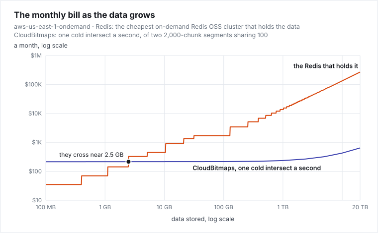
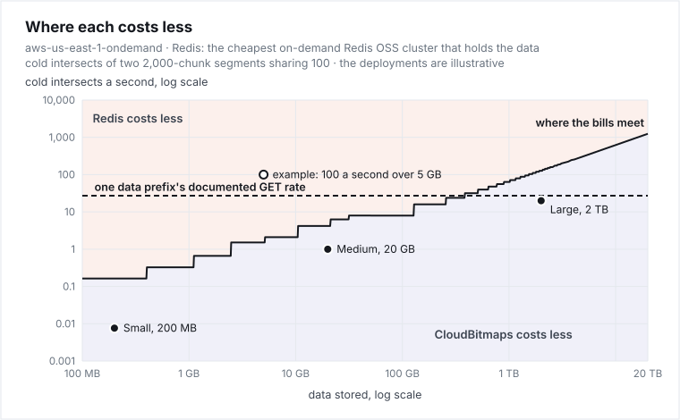

# What it saves, and where it doesn't

For anyone deciding whether to keep large bitmap sets in CloudBitmaps or in an always-on Redis. Every cost here
comes from the library's own `estimateCost()`, and every figure, AWS's published prices and limits among them, is
written into this page by `bench/sizing.cjs` and checked against it by CI, which also refuses a dollar amount, a
share, a multiple or a request count typed anywhere else on the page. The prices are AWS's `us-east-1` list prices,
on demand unless a sentence says otherwise, and the three deployments are illustrative workloads, not anyone's
measured system. There is no latency figure, because none has been measured inside a region yet.

A **segment** is a named set of ids, stored in chunks of up to 65,536 ids each. A **cold intersect** is an
intersection that starts from an empty cache, so it fetches every chunk it needs; a **point read** is one `has()`;
and a **pointer refresh** is the read of a segment's pointer that a reader makes before trusting a copy older than
`cache.genTtlMs`. [How it works](../../README.md#how-it-works) has the rest.

## Contents

- [The short answer](#the-short-answer)
- [Where the money goes](#where-the-money-goes)
- [What each bill grows with](#what-each-bill-grows-with)
- [Where each costs less](#where-each-costs-less)
- [How much room each deployment has](#how-much-room-each-deployment-has)
- [Where it loses](#where-it-loses)
- [What is planned for each weakness](#what-is-planned-for-each-weakness)
- [Beyond the bill](#beyond-the-bill)
- [What this page does not establish](#what-this-page-does-not-establish)

## The short answer

| CloudBitmaps is for | Redis is for |
| --- | --- |
| many segments, most of them rarely queried | a small set, queried constantly |
| audiences, cohorts, catalogue facets, history | a live leaderboard, or a flag read on every request |
| data that outgrows one machine's memory | data cheap to hold in memory around the clock |
| bursty or batch queries | thousands of queries a second that miss any cache |
| paying for storage and for each read | paying for memory, around the clock |

What that is worth at three sizes, each against the cheapest on-demand Redis OSS cluster that would hold its data:

<!-- SIZING:WHY_DEPLOYMENTS:START -->
```text
                      $1        $10       $100      $1K       $10K      $100K   a month, log scale
                      │         │         │         │         │         │
Small   CloudBitmaps       ●                                               $3.35
        Redis                        ●                                     $35.04
Medium  CloudBitmaps                          ●                            $281
        Redis                                       ●                      $900
Large   CloudBitmaps                                        ●              $6,771
        Redis                                                     ●        $27,325
        Redis in RAM                                                   ●   $85,509
```

- **Small**, 200 MB: $3.35 a month against $35.04 for 3 × t4g.micro, so CloudBitmaps costs **90% less**.
- **Medium**, 20 GB: $281 a month against $900 for 3 × r6g.xlarge, so CloudBitmaps costs **69% less**.
- **Large**, 2 TB: $6,771 a month against $27,325 for 3 × r6gd.16xlarge, so CloudBitmaps costs **75% less**.
- The large deployment's Redis keeps the values read least recently on its SSD. All in memory it would be $85,509 a month, and CloudBitmaps 92% less.
<!-- SIZING:WHY_DEPLOYMENTS:END -->

<!-- SIZING:WHY_LEANINGS:START -->
Each Redis is the cheapest on-demand ElastiCache for Redis OSS cluster in the estimator's catalogue that holds the data, every shard a primary and two replicas: the cheapest of one kind, not the least Redis could cost. Against [ElastiCache for Valkey](https://aws.amazon.com/elasticache/pricing/), which AWS prices 20% lower a node, CloudBitmaps costs 88% less, 61% less and 69% less; with one replica a shard, 86% less, 53% less and 63% less; with both, 82% less, 41% less and 54% less. Reserved nodes cost less again, and stack on both: on a one-year term with nothing upfront, CloudBitmaps costs 74% less, 14% less and 32% less, and on three years paid upfront, 60% less, 1.3× as much and 1.03× as much, so a Redis bought all three ways costs less than CloudBitmaps at the medium and large sizes.

The large deployment's 200,000 segments are past the roughly 100,000 the library has been validated at, and its readers would need an index budget and a chunk cache far past their defaults ([what each reader holds](sizing.md#what-each-reader-holds)), in memory not priced here.
<!-- SIZING:WHY_LEANINGS:END -->

The saving is largest in dollars where the data is large and mostly cold. Small data queried hard is Redis's ground, and there the answer is a
cache in front, or Redis itself. For a large company the usual answer is both: CloudBitmaps holds the long tail, and a
cache or a Redis node fronts the one or two hottest paths. [What it costs at your size](sizing.md) has each
deployment's bill, term by term.

## Where the money goes

The two bills charge for different things:

<!-- SIZING:MONEY:START -->
```text
 REDIS: all your data on its nodes, billed around the clock
 ┌──────────────────────────────────────────────────────────────┐
 │ all your data ──► memory, on a primary and its replicas      │ ──► billed every hour, queried or not
 │ (a data-tiering node moves the least recently read to SSD)   │
 │ 2 replicas a shard; 25% of each node's memory kept back      │
 └──────────────────────────────────────────────────────────────┘

 CLOUDBITMAPS: every byte in object storage, each read paid for
 ┌──────────────────────────────────────────────────────────────┐
 │ all your data   ──► S3, $0.023 a GiB-month                   │ ──► under $0.01 to $42.84 a month here
 │ the hot part    ──► your readers' memory, a slice of it      │ ──► your own machines
 │ each cold read  ──► S3 GETs, $0.40 a million                 │ ──► grows with the queries
 │ each refresh    ──► a pointer GET, after cache.genTtlMs      │ ──► at most one a read, and one per segment per reader each genTtlMs
 │ each load       ──► S3 PUTs, and a pointer write             │ ──► grows with how often the data changes
 └──────────────────────────────────────────────────────────────┘
```
<!-- SIZING:MONEY:END -->

So each bill grows with something different:

<!-- SIZING:WHY_MOVES:START -->
- **Redis grows with how much data you have**: in steps while the data fits a few nodes, then in proportion to it, every replica with it.
- **CloudBitmaps grows with its reads.** Storage is 0.63% of the large deployment's bill, for one copy of its data; `load()` also keeps the generation it replaced by default, which would make it 1.3%. The rest is the cold reads that miss a reader's cache; the pointer refresh, at most one a read and one per segment per reader each `cache.genTtlMs`, which is 31% of the large bill and 19% of the medium's; and the loads, 3.4% of the large bill ([what moves the large bill](sizing.md#what-moves-the-large-bill)).
<!-- SIZING:WHY_MOVES:END -->

## What each bill grows with

<!-- SIZING:WHY_CHART_BILL:START -->
<picture>
  <source media="(prefers-color-scheme: dark)" srcset="../../bench/bill-as-data-grows-dark.svg">
  
</picture>
<!-- SIZING:WHY_CHART_BILL:END -->

The same figures as a table, with a last column that the next chart plots: how many cold intersects a second each
size of data can run before CloudBitmaps' bill meets its Redis.

<!-- SIZING:GROWS:START -->
| data stored | the Redis that holds it | its nodes | CloudBitmaps, one cold intersect a second | where the bill meets the Redis |
|---:|---:|---|---:|---:|
| 200 MB | $35.04 | 3 × t4g.micro | $214 | 0.16 a second |
| 1 GB | $70.08 | 3 × t4g.small | $214 | 0.33 a second |
| 5 GB | $326 | 3 × m6g.large | $215 | 1.5 a second |
| 20 GB | $900 | 3 × r6g.xlarge | $215 | 4.2 a second |
| 200 GB | $3,416 | 3 × r6gd.2xlarge | $219 | 16 a second |
| 2 TB | $27,325 | 3 × r6gd.16xlarge | $257 | 127 a second |
| 20 TB | $268,531 | 471 × r6gd.xlarge, 157 shards | $643 | 1,250 a second |

The 20 TB cluster's 471 nodes are past ElastiCache's [default quotas](https://docs.aws.amazon.com/general/latest/gr/elasticache-service.html#limits_elasticache) of 90 nodes a cluster and 300 a Region. AWS raises them on request, a cluster to [at most 500 nodes](https://docs.aws.amazon.com/AmazonElastiCache/latest/dg/Shards.html) on Redis OSS 5.0.6 to 7.1 or Valkey 7.2 and later.
<!-- SIZING:GROWS:END -->

## Where each costs less

<!-- SIZING:WHY_CHART_WHERE:START -->
<picture>
  <source media="(prefers-color-scheme: dark)" srcset="../../bench/where-each-costs-less-dark.svg">
  
</picture>
<!-- SIZING:WHY_CHART_WHERE:END -->

<!-- SIZING:WHY_LINE:START -->
The line is the table's last column. It climbs with the data because the Redis it is measured against does. In this model an extra cold intersect costs CloudBitmaps the same at any size: every segment keeps the [calibration run](../../bench/calibration/2026-09-23-94416.md)'s shape, 2,000 chunks with 100 shared, so a larger store is more segments of that shape, not larger ones. Segments that grow by sharing more chunks cost more, as [overlap](#where-it-loses) shows. The chart counts cold intersects alone; the three deployments also make point reads and refresh pointers, which [the next section](#how-much-room-each-deployment-has) counts in.
<!-- SIZING:WHY_LINE:END -->

## How much room each deployment has

How many cold intersects a second each could run before its whole bill meets its Redis, every other term held where
it is. It is where the bills cross, not a capacity: S3's own request rate is a limit of its own,
[below](#where-it-loses).

<!-- SIZING:WHY_ROOM:START -->
| | data | cold intersects a second | where the bill meets its Redis | room |
|---|---:|---:|---:|---:|
| **Small** | 200 MB | 0.0076 | 0.16 | **20×** |
| **Medium** | 20 GB | 1.0 | 3.9 | **3.9×** |
| **Large** | 2 TB | 20 | 116 | **5.8×** |
<!-- SIZING:WHY_ROOM:END -->

## Where it loses

**Small data, queried hard.** Pay-per-request loses to a node that costs the same however hard it is used:

<!-- SIZING:HOT:START -->
A dashboard running 100 cold intersects a second over 5 GB costs **$21,445** a month, where the Redis that holds 5 GB costs **$326** (3 × m6g.large): CloudBitmaps costs **66×** as much there, and Redis answers from memory. That is priced cold, as if nothing repeated. A dashboard that repeats its queries is served from the chunk cache when their chunks fit it, 1,024 by default, and then pays only for its pointer reads, once each `cache.genTtlMs`; one that ranges over more than a reader's cache holds is Redis's ground, or a cache's in front of CloudBitmaps.
<!-- SIZING:HOT:END -->

**Latency.** Redis answers from memory. A cold intersect waits on object storage, one round of requests after
another:

<!-- SIZING:DEPTH:START -->
A cold intersect of two segments sharing 100 chunks makes its requests in **15 rounds**, one after another: both operands' pointers, then both indexes, then the shared chunks 8 at a time, each from both operands. Each round waits for the slowest of its requests, not a typical one, so what the rounds take is for a measurement to say. A repeat served from the chunk cache makes no request within `cache.genTtlMs`, and one round of pointer reads after it.
<!-- SIZING:DEPTH:END -->

Neither is timed yet: the in-region run is owed.

**S3's request rate.**

<!-- SIZING:WHY_PREFIX:START -->
AWS documents [at least 5,500 GET requests a second per partitioned prefix](https://docs.aws.amazon.com/AmazonS3/latest/userguide/optimizing-performance.html), and answers `503 Slow Down` while it scales one. A namespace's segments share one data prefix. The large deployment's reads average **4,140 GETs a second** on it, **75%** of that documented rate before any peak, and would reach it at 1.3× its load: spread segments across namespaces, and expect throttling at peaks. A throttled GET is retried by the [AWS SDK](https://docs.aws.amazon.com/sdkref/latest/guide/feature-retry-behavior.html), 3 attempts by default, inside each of the library's 4: up to 12 requests for one.
<!-- SIZING:WHY_PREFIX:END -->

**Overlap.**

<!-- SIZING:WHY_OVERLAP:START -->
A cold intersect costs 4 + 2k GETs for k shared chunks, so segments that share most of their chunks cost far more to intersect than their size suggests. At 1,000 shared chunks of 2,000, where the tables above assume 100, the medium deployment's bill comes to **2.4×** its Redis's price, and the large one's to **1.6×**; they pass it at 395 and 589 shared chunks.
<!-- SIZING:WHY_OVERLAP:END -->

## What is planned for each weakness

None of this is built yet. Each item is a design direction, and several change the public API, so each will be
proposed in an issue on this repo before it is built.

| Weakness | What is planned | What it should change |
| --- | --- | --- |
| Overlap, and the requests of a cold intersect | **Coalesced reads**: fetch neighbouring chunks, or a small segment whole, in one ranged GET, still checking each chunk's checksum | A cold intersect's requests, and its rounds of them, stop growing with the overlap where the shared chunks lie together; layouts that spread them are to be measured first |
| Small data queried hard | **A reader cache sized by bytes**, not by chunk count, and a small segment kept whole after its first read | A repeat stays cached however many small chunks it touches, bounded by bytes rather than a count; pointers are still re-read after `cache.genTtlMs` |
| Many stateless readers | **A shared cache tier**: a port that a Valkey, Redis or local-disk adapter implements, holding only the hot set | A fleet shares one warm copy of the hot set instead of each reader paying for its own |
| The pointer refresh | **Push invalidation**: object-store events tell readers a segment changed, with a longer refresh as the backstop | Most of the refresh bill goes, and a change reaches readers as fast as the events do: [typically seconds, sometimes a minute or longer](https://docs.aws.amazon.com/AmazonS3/latest/userguide/EventNotifications.html), with the backstop as the bound |
| Retries in a throttling storm | **Retrying at one layer**, the SDK's, for throttling | One throttled request stops multiplying into many |
| Reader memory | **Measuring the index's real heap**, and storing it compactly | The memory bound becomes exact, and holds more segments open |
| GCS and Azure reads | **One request per pointer read** on both, and a one-request tail read on GCS | Their pointer reads cost what S3's do, and so do GCS's index reads; an Azure tail read stays two requests |

## Beyond the bill

- **No servers to run.** It is a library over your own bucket: it runs from a function, and an idle store pays only for
  storage.
- **Durability is the object store's.** S3 Standard is
  [designed for eleven nines of durability](https://aws.amazon.com/s3/storage-classes/), with no replicas for you to
  manage.
- **Reader memory is bounded by its caches, not by the store's size.** A reader holds only what it reads, within the
  index budget and chunk cache you give it, however large the store. A load still holds a
  segment's distinct ids in memory, and ids are 32-bit; 64-bit ids and an external-merge load are
  [planned](../ROADMAP.md#planned--exploring).
- **A portable format, and a one-command exit.** Each chunk is standard portable Roaring, which every maintained
  Roaring library reads, and `store.exportSegments(sink)` writes every segment out.

## What this page does not establish

- **Latency.** Nothing here says how fast a query returns; the in-region run is owed.
- **A warm reader's intersects.** They are priced cold: an upper bound on their requests, but for a pointer re-read
  by a call that outlives `cache.genTtlMs`, and a second index read for an index larger than the reader's tail read.
- **Your readers' memory.** It is your own machines' cost, and not priced here.
- **An invoice.** These are list prices applied to modeled request counts; data transfer out of the region is not
  modeled.
- **What running Redis takes besides its price**: the operations, the failovers, and its speed, which is Redis's to
  win.
