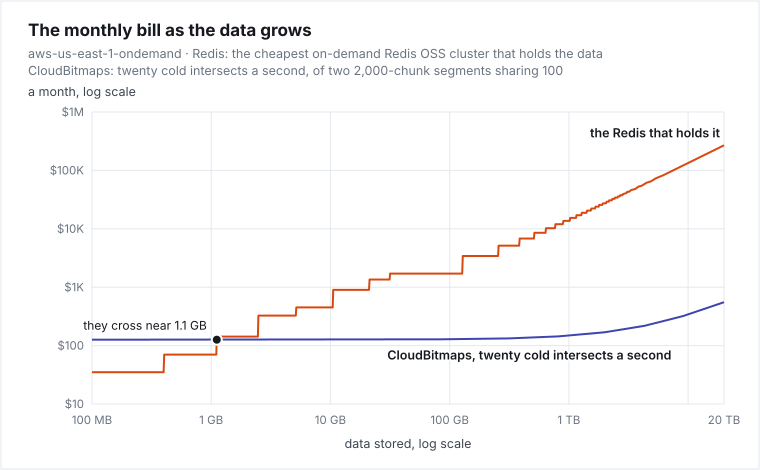
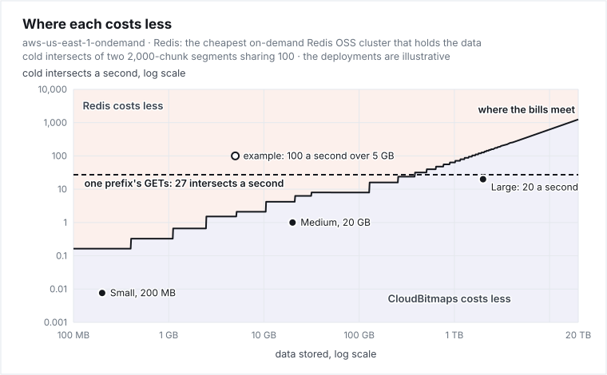

# What it saves, and where it doesn't

For anyone deciding whether to keep large bitmap sets in CloudBitmaps or in an always-on Redis. [The short
answer](#the-short-answer) is first. Every cost here comes from the library's own `estimateCost()`. The prices are AWS's
`us-east-1` list prices, on demand unless a sentence says otherwise, and the three deployments are illustrative
workloads, not anyone's measured system. The one latency figure is the [in-region run's](../benchmarks.md#real-cloud-calibration--aws), quoted where it
applies.

A **segment** is a named set of ids, stored in chunks of up to 65,536 ids each. A **cold intersect** is an
intersection that starts from an empty cache, so it fetches every chunk it needs; a **point read** is one `has()`;
and a **pointer refresh** is the read of a segment's pointer that a reader makes before trusting a copy older than
`cache.genTtlMs`. [How it works](../../README.md#how-it-works) has the rest.

## Contents

- [The short answer](#the-short-answer)
- [Where the money goes](#where-the-money-goes)
- [What each bill grows with](#what-each-bill-grows-with)
- [Where each costs less](#where-each-costs-less)
- [How much room each deployment has](#how-much-room-each-deployment-has)
- [Where it loses](#where-it-loses)
- [What is planned for each weakness](#what-is-planned-for-each-weakness)
- [Beyond the bill](#beyond-the-bill)
- [What this page does not establish](#what-this-page-does-not-establish)

## The short answer

| CloudBitmaps is for | Redis is for |
| --- | --- |
| many segments, most of them rarely queried | a small set, queried constantly |
| audiences, cohorts, catalogue facets, history | a live leaderboard, or a flag read on every request |
| data that outgrows one machine's memory | data cheap to hold in memory around the clock |
| bursty or batch queries | thousands of queries a second that miss any cache |
| paying for storage and for each read | paying for memory, around the clock |

What that is worth at three sizes, each against the cheapest on-demand Redis OSS cluster that would hold its data:

<!-- SIZING:WHY_DEPLOYMENTS:START -->
```text
                      $1        $10       $100      $1K       $10K      $100K   a month, log scale
                      │         │         │         │         │         │
Small   CloudBitmaps    ●                                                  $1.70
        Redis                        ●                                     $35.04
Medium  CloudBitmaps                     ●                                 $71.66
        Redis                                       ●                      $900
Large   CloudBitmaps                                    ●                  $2,541
        Redis                                                     ●        $27,325
        Redis in RAM                                                   ●   $85,509
```

- **Small**, 200 MB: $1.70 a month against $35.04 for 3 × t4g.micro, so CloudBitmaps costs **95% less**.
- **Medium**, 20 GB: $71.66 a month against $900 for 3 × r6g.xlarge, so CloudBitmaps costs **92% less**.
- **Large**, 2 TB: $2,541 a month against $27,325 for 3 × r6gd.16xlarge, so CloudBitmaps costs **91% less**.
- The large deployment's Redis keeps the values read least recently on its SSD. All in memory it would be $85,509 a month, for 285 × r6g.xlarge, 95 shards, past ElastiCache's default quota of 90 nodes a cluster, and CloudBitmaps 97% less.
<!-- SIZING:WHY_DEPLOYMENTS:END -->

<!-- SIZING:WHY_LEANINGS:START -->
Each Redis is the cheapest on-demand ElastiCache for Redis OSS cluster in the estimator's catalogue that holds the data, every shard a primary and two replicas: the cheapest of one kind, not the least Redis could cost. Against [ElastiCache for Valkey](https://aws.amazon.com/elasticache/pricing/), which AWS prices 20% lower a node, CloudBitmaps costs 94% less, 90% less and 88% less; with one replica a shard, 93% less, 88% less and 86% less; with both, 91% less, 85% less and 83% less. Reserved nodes cost less again, and stack on both: on a one-year term with nothing upfront, CloudBitmaps costs 87% less, 78% less and 74% less, and on three years paid upfront, 80% less, 67% less and 61% less.

The large deployment's 200,000 segments are past the roughly 100,000 the library has been validated at, and its readers would need an index budget and a chunk cache far past their defaults ([what each reader holds](sizing.md#what-each-reader-holds)), in memory not priced here.
<!-- SIZING:WHY_LEANINGS:END -->

Against on-demand Redis, the saving is largest in dollars where the data is large and mostly cold. Small data queried hard is Redis's ground, and there the answer is a
cache in front, or Redis itself. For a large company the usual answer is both: CloudBitmaps holds the long tail, and a
cache or a Redis node fronts the one or two hottest paths. [What it costs at your size](sizing.md) has each
deployment's bill, term by term.

## Where the money goes

The two bills charge for different things:

<!-- SIZING:MONEY:START -->
```text
 REDIS: all your data on its nodes, billed around the clock
 ┌──────────────────────────────────────────────────────────────┐
 │ all your data ──► memory, on a primary and its replicas      │ ──► billed every hour, queried or not
 │ (a data-tiering node moves the least recently read to SSD)   │
 │ 2 replicas a shard; 25% of each node's memory kept back      │
 └──────────────────────────────────────────────────────────────┘

 CLOUDBITMAPS: every byte in object storage, each read paid for
 ┌──────────────────────────────────────────────────────────────┐
 │ all your data   ──► S3, $0.023 a GiB-month                   │ ──► under $0.01 to $42.84 a month here
 │ the hot part    ──► your readers' memory, a slice of it      │ ──► your own machines
 │ each cold read  ──► S3 GETs, $0.40 a million                 │ ──► grows with the queries
 │ each refresh    ──► a reader's pointer GET, after genTtlMs   │ ──► at most one a read, and one a genTtlMs
 │ each load       ──► S3 PUTs and GETs, a pointer write        │ ──► grows with how often the data changes
 └──────────────────────────────────────────────────────────────┘
```
<!-- SIZING:MONEY:END -->

So each bill grows with something different:

<!-- SIZING:WHY_MOVES:START -->
- **Redis grows with how much data you have**: in steps while the data fits a few nodes, then in proportion to it, every replica with it.
- **CloudBitmaps grows with its reads.** Storage is 1.7% of the large deployment's bill, for one copy of its data; `load()` also keeps the generation it replaced by default, which would make it 3.3%. The rest is the cold reads that miss a reader's cache; the pointer refresh, at most one a read and one per segment per reader each `cache.genTtlMs`, which is 83% of the large bill and 73% of the medium's; and the loads, 6.5% of the large bill ([what moves the large bill](sizing.md#what-moves-the-large-bill)).
<!-- SIZING:WHY_MOVES:END -->

## What each bill grows with

<!-- SIZING:WHY_CHART_BILL:START -->
<picture>
  <source media="(prefers-color-scheme: dark)" srcset="../../bench/bill-as-data-grows-dark.svg">
  
</picture>
<!-- SIZING:WHY_CHART_BILL:END -->

The same figures as a table, with a last column that the next chart plots: how many cold intersects a second each
size of data can run before CloudBitmaps' bill meets its Redis.

<!-- SIZING:GROWS:START -->
| data stored | the Redis that holds it | its nodes | CloudBitmaps, twenty cold intersects a second | where the bill meets the Redis |
|---:|---:|---|---:|---:|
| 200 MB | $35.04 | 3 × t4g.micro | $126 | 5.6 a second |
| 1 GB | $70.08 | 3 × t4g.small | $126 | 11 a second |
| 5 GB | $326 | 3 × m6g.large | $126 | 52 a second |
| 20 GB | $900 | 3 × r6g.xlarge | $127 | 143 a second |
| 200 GB | $3,416 | 3 × r6gd.2xlarge | $130 | 541 a second |
| 2 TB | $27,325 | 3 × r6gd.16xlarge | $169 | 4,325 a second |
| 20 TB | $268,531 | 471 × r6gd.xlarge, 157 shards | $555 | 42,507 a second |

The 20 TB cluster's 471 nodes are past ElastiCache's [default quotas](https://docs.aws.amazon.com/general/latest/gr/elasticache-service.html#limits_elasticache) of 90 nodes a cluster and 300 a Region. AWS raises them on request, a cluster to [at most 500 nodes](https://docs.aws.amazon.com/AmazonElastiCache/latest/dg/Shards.html) on Redis OSS 5.0.6 to 7.1 or Valkey 7.2 and later.
<!-- SIZING:GROWS:END -->

## Where each costs less

<!-- SIZING:WHY_CHART_WHERE:START -->
<picture>
  <source media="(prefers-color-scheme: dark)" srcset="../../bench/where-each-costs-less-dark.svg">
  
</picture>
<!-- SIZING:WHY_CHART_WHERE:END -->

<!-- SIZING:WHY_LINE:START -->
The line is the table's last column. It climbs with the data because the Redis it is measured against does. In this model an extra cold intersect costs CloudBitmaps the same at any size: every segment keeps the [calibration run](../../bench/calibration/2026-09-23-94416.md)'s shape, about 2,000 chunks with 100 shared, so a larger store is more segments of that shape, not larger ones. Segments that grow by sharing more chunks cost more, as [overlap](#where-it-loses) shows. The chart counts cold intersects alone; the three deployments also make point reads and refresh pointers, which [the next section](#how-much-room-each-deployment-has) counts in.
<!-- SIZING:WHY_LINE:END -->

## How much room each deployment has

How many cold intersects a second each could run before its whole bill meets its Redis, every other term held where
it is. It is where the bills cross, not a capacity: S3's own request rate is a limit of its own,
[below](#where-it-loses).

<!-- SIZING:WHY_ROOM:START -->
| | data | cold intersects a second | where the bill meets its Redis | room |
|---|---:|---:|---:|---:|
| **Small** | 200 MB | 0.00761 | 5.29 | **700×** |
| **Medium** | 20 GB | 1 | 132 | **130×** |
| **Large** | 2 TB | 20 | 3,949 | **200×** |
<!-- SIZING:WHY_ROOM:END -->

## Where it loses

**Small data, queried hard.** Pay-per-request loses to a node that costs the same however hard it is used:

<!-- SIZING:HOT:START -->
A dashboard running 200 cold intersects a second over 5 GB costs **$1,262** a month, where the Redis that holds 5 GB costs **$326** (3 × m6g.large): CloudBitmaps costs **4×** as much there, and Redis answers from memory. That is priced cold, as if nothing repeated. A dashboard that repeats its queries is served from the chunk cache when their chunks fit it, 1,024 by default, and then pays only for its pointer reads, once each `cache.genTtlMs`; one that ranges over more than a reader's cache holds is Redis's ground, or a cache's in front of CloudBitmaps.
<!-- SIZING:HOT:END -->

**Latency.** Redis answers from memory. A cold intersect waits on object storage, request after request:

<!-- SIZING:DEPTH:START -->
A cold intersect of two segments sharing 100 chunks waits on a chain of requests, derived from the engine's constants, **3 deep**: both operands' pointers, then both indexes, then each operand's range of shared chunks, a stream that opens 4 ranges wide and widens to 32, so up to 2 requests are in flight. At an even latency that is 3 request times end to end. A slow request holds up those queued behind it. The in-region run of 2026-10-04 measured 3.6 request times for this shape, 95.03 ms at the median, above the derived 3, with a mean of 1.7 requests in flight and a peak of 2, against its client's 128 sockets. It did not vary the socket count, so it does not say why the rounds differ from the derived chain. A repeat served from the chunk cache makes no request within `cache.genTtlMs`, and one round of pointer reads after it.
<!-- SIZING:DEPTH:END -->

The in-region run timed one shape of cold intersect, its sweep over the overlap, an `andNot` and the point reads; the [benchmarks page](../benchmarks.md#real-cloud-calibration--aws) has the figures. The other shapes are not timed.

**S3's request rate.**

<!-- SIZING:WHY_PREFIX:START -->
AWS documents [at least 5,500 GET requests a second per partitioned prefix](https://docs.aws.amazon.com/AmazonS3/latest/userguide/optimizing-performance.html), and answers `503 Slow Down` while it scales one. A namespace's segments share one data prefix. The large deployment's reads average **180 GETs a second** on it, **3%** of that documented rate before any peak, and would reach it at 31× its load: spread segments across namespaces, and expect throttling at peaks. A throttled GET is retried by the [AWS SDK](https://docs.aws.amazon.com/sdkref/latest/guide/feature-retry-behavior.html), 3 attempts by default, inside each of the library's 4: up to 12 requests for one.
<!-- SIZING:WHY_PREFIX:END -->

**Overlap.**

<!-- SIZING:WHY_OVERLAP:START -->
A cold intersect costs 4 + 2r GETs for r range requests of each segment, and r follows the bytes the shared chunks span in the object, not how many there are: segments whose shared chunks are spread over them read most of each object. With every chunk shared and spread, the medium and large deployments cost 0.087× and 0.11× their Redis, and an intersect reads 8 MB and 20 MB from the two objects.
<!-- SIZING:WHY_OVERLAP:END -->

## What is planned for each weakness

None of this is built yet. Each item is a design direction, and several change the public API, so each will be
proposed in an issue on this repo before it is built.

| Weakness | What is planned | What it should change |
| --- | --- | --- |
| Small data queried hard | **A chunk cache sized by bytes**, not by chunk count | A repeat stays cached however many small chunks it touches, bounded by bytes rather than a count; pointers are still re-read after `cache.genTtlMs` |
| Many stateless readers | **A shared cache tier**: an interface that a Valkey, Redis or local-disk adapter implements, holding only the hot set | A fleet shares one warm copy of the hot set instead of each reader paying for its own |
| The pointer refresh | **Push invalidation**: object-store events tell readers a segment changed, with a longer refresh as the backstop | Most of the refresh bill goes, and a change reaches readers as fast as the events do: [typically seconds, sometimes a minute or longer](https://docs.aws.amazon.com/AmazonS3/latest/userguide/EventNotifications.html), with the backstop as the bound |
| Retries in a throttling storm | **Retrying at one layer**, the SDK's, for throttling | One throttled request stops multiplying into many |

## Beyond the bill

- **No servers to run.** It is a library over your own bucket: it runs from a function, and an idle store pays only for
  storage.
- **Durability is the object store's.** S3 Standard is
  [designed for eleven nines of durability](https://aws.amazon.com/s3/storage-classes/), with no replicas for you to
  manage.
- **Reader memory is set by what it reads, not by the store's size.** A reader holds the index budget and chunk cache
  you give it, and the chunks an intersect has in flight, however large the store; one segment whose index alone
  is past the budget is still held, alone. A load still holds a
  segment's distinct ids in memory, and ids are 32-bit; 64-bit ids and an external-merge load are
  [planned](../ROADMAP.md#planned--exploring).
- **A portable format, and a one-command exit.** Each chunk is standard portable Roaring, which every maintained
  Roaring library reads, and `store.exportSegments(sink)` writes every segment out ([export your data](export.md)). A
  pure Roaring library has no lock-in because it manages no storage: you persist its bytes, in the same format. A
  bitmap database or service, such as FeatureBase, ClickHouse, Doris or Redis, manages storage for you and keeps your
  data in its engine, behind its own export. CloudBitmaps sits between these: a library over storage you own.

## What this page does not establish

- **Latency.** Nothing here says how fast a query returns; the [in-region run](../benchmarks.md#real-cloud-calibration--aws) measured one shape.
- **A warm reader's intersects.** They are priced cold: an upper bound on their requests, but for what a call reads
  again when it outlives `cache.genTtlMs` (a pointer, and an index once the segment's row has changed, as a load's
  publish changes it) or the reader cache evicts its reader part-way through (a pointer and an index), and a second
  index read for an index larger than the reader's tail read.
- **Your readers' memory.** It is your own machines' cost, and not priced here.
- **An invoice.** These are list prices applied to modeled request counts; data transfer out of the region is not
  modeled.
- **What running Redis takes besides its price**: the operations, the failovers, and its speed, which is Redis's to
  win.

**How the figures are kept honest.** Every dollar amount, share, multiple and request count on this page written in
digits, AWS's published prices among them, is written into it by `bench/sizing.cjs` and checked against it by CI. CI
refuses any other digit on the page, bar a few names such as `us-east-1`, and the HTML, images and code fences that
could hide one; a figure written in words, it refuses in the spellings it knows.
